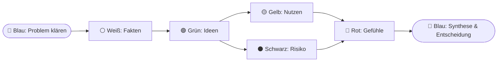

# DENKHUT-6

> **De Bono Six Thinking Hats – Multiagentensystem für Claude Code**


**DENKHUT-6** bringt Edward de Bonos Methode der *Six Thinking Hats* als echtes Multiagentensystem nach Claude Code: Jeder Denkhut ist ein eigener Subagent mit isoliertem Kontext, der Blaue Hut orchestriert die Sitzung.

## Was ist das

Die *Six Thinking Hats* sind eine Methode des **parallelen Denkens**: Statt dass alle gleichzeitig argumentieren und gegeneinander debattieren, betrachten alle Beteiligten dasselbe Problem zur selben Zeit aus *einer* festgelegten Richtung. Jeder „Hut" steht für einen Denkmodus – nicht für eine Person, sondern für eine **Rolle**. Man setzt einen Hut bewusst auf und wieder ab. So werden Fakten, Gefühle, Risiken, Nutzen und Ideen sauber getrennt statt vermischt. DENKHUT-6 übersetzt diese sechs Modi in sechs spezialisierte Subagents, die nacheinander oder parallel auf ein Problem schauen und deren Beiträge der Blaue Hut zu einer Entscheidung zusammenführt.

## Wofür eignet sich DENKHUT-6?

DENKHUT-6 ist **nicht nur für Probleme** da, sondern für jede Fragestellung, die von mehreren getrennten Denkperspektiven profitiert – ausdrücklich auch für **Ideen- und Produktentwicklung**. Der **Grüne Hut** ist der Kreativ-Motor: Eine Idee wird nicht nur geprüft, sondern aktiv ausgebaut (Varianten, Kombinationen, MVP-Zuschnitte), bevor Gelb und Schwarz sie abwägen.

| Einsatzzweck | Beispiel | Empfohlene Sequenz |
|---|---|---|
| Entscheidung (Go/No-Go) | „Sollen wir die 4-Tage-Woche einführen?" | `entscheidung` |
| **Idee / Produktentwicklung** | „Idee für ein SaaS-Tool – tragfähig? Wie zuschneiden?" | `ideenfindung` |
| Bewertung / Review | „Ist dieser Plan gut?" | `bewertung` |
| Schneller Risiko-/Plausibilitäts-Check | „Vor dem Commit kurz gegenchecken" | `schnell-review` |

Für eine **Produktidee** liefern die Hüte z. B.: Weiß = Markt/Zielgruppe/Annahmen · Grün = Feature- und MVP-Varianten · Gelb = Nutzen/Geschäftsmodell · Schwarz = technische & Markt-Risiken · Rot = Bauchgefühl von Nutzern/Investoren/Team · Blau = MVP-Empfehlung & nächste Schritte. Vollständig durchgespielt: [`beispiel/software-produktidee/`](beispiel/software-produktidee/).

## Die 6 Hüte

| Hut | Denkmodus | liefert | Subagent |
|-----|-----------|---------|----------|
| ⚪ Weißer Hut | Fakten & Information | Fakten, Annahmen, Wissenslücken | `weisser-hut` |
| 🔴 Roter Hut | Gefühle & Intuition | Emotionen pro Stakeholder (ohne Begründung) | `roter-hut` |
| ⚫ Schwarzer Hut | Risiko & Kritik | begründete Risiken | `schwarzer-hut` |
| 🟡 Gelber Hut | Nutzen & Wert | Chancen, Nutzen, Erfolgsbedingungen | `gelber-hut` |
| 🟢 Grüner Hut | Kreativität & Alternativen | Ideen, Varianten, Kombinationen | `gruener-hut` |
| 🔵 Blauer Hut | Prozess & Synthese | Problemklärung, Sequenz, Zusammenfassung, Entscheidung | `blauer-hut` |

## Ablauf der Orchestrierung

Standard-Sequenz **Entscheidung** (Default). Gelber und Schwarzer Hut arbeiten parallel, der Blaue Hut steht am Anfang und am Ende.



```
🔵 Blau ─► ⚪ Weiß ─► 🟢 Grün ─┬─► 🟡 Gelb ─┐
                                └─► ⚫ Schwarz ┴─► 🔴 Rot ─► 🔵 Blau
                                (Gelb & Schwarz parallel)
```

## Installation

DENKHUT-6 wird als **Claude-Code-Plugin direkt aus GitHub** installiert – zwei Befehle, kein manuelles Kopieren. In Claude Code eingeben:

```
/plugin marketplace add afriedrich80/DENKHUT-6
/plugin install denkhut-6@denkhut-6
```

Danach `/reload-plugins` ausführen oder Claude Code neu starten. Spätere Updates: `/plugin marketplace update denkhut-6`.

> Voraussetzung: eine aktuelle Claude-Code-Version (der `/plugin`-Befehl muss verfügbar sein).

### Nutzung

Nach der Installation sind Orchestrator-Skill und die sechs Hut-Subagents aktiv. Eine Sitzung startest du auf zwei Wegen:

- **Per Slash-Command** (Plugin-Skills sind namespaced mit `denkhut-6:`):

  ```
  /denkhut-6:denkhut <Thema>
  ```

  Beispiel: `/denkhut-6:denkhut Sollen wir auf die 4-Tage-Woche umstellen?`

- **Per natürlicher Sprache** – Claude ruft den Orchestrator automatisch auf:
  „Analysiere mit den sechs Denkhüten, ob wir auf die 4-Tage-Woche umstellen sollten."

### Alternative: lokal ohne Marketplace

Zum Entwickeln/Testen ohne Installation:

```
claude --plugin-dir ./denkhut-6
```

Oder die Inhalte von `agents/`, `skills/` und `commands/` nach `~/.claude/` (global) bzw. `<projekt>/.claude/` (projektweit) kopieren – dann laufen die Skills **ohne** Namespace, der Command lautet schlicht `/denkhut`.

## Wie es funktioniert

Jeder Hut ist ein **echter Claude-Code-Subagent** (Definition in `agents/`) mit **isoliertem Kontext**. Der Blaue Hut ruft die Hut-Subagents über das **Agent-Tool** auf, gibt ihnen den jeweils relevanten Vor-Kontext mit und sammelt deren strukturierte Ausgaben ein. Weil jeder Hut nur seinen einen Denkmodus kennt, bleibt das Denken **sauber getrennt** – kein Hut „rutscht" in eine andere Rolle. Hüte ohne Abhängigkeit (z. B. **Gelb** und **Schwarz**) laufen **parallel**. Am Ende verdichtet der Blaue Hut alle Beiträge zu einer Synthese mit Empfehlung.

## Projektstruktur

```
denkhut-6/
├── .claude-plugin/
│   └── plugin.json          # Plugin-Manifest
├── agents/                  # die 6 Hut-Subagents
│   ├── weisser-hut.md
│   ├── roter-hut.md
│   ├── schwarzer-hut.md
│   ├── gelber-hut.md
│   ├── gruener-hut.md
│   └── blauer-hut.md
├── skills/                  # Orchestrierungs-Skills
│   ├── denkhut-6/           # Orchestrator
│   ├── denkhut-sequenz/     # Sequenz-Logik
│   └── denkhut-protokoll/   # Protokollierung
├── commands/
│   └── denkhut.md           # Slash-Command /denkhut-6:denkhut
├── schemas/                 # JSON-Schemas der Datenstrukturen
├── templates/               # Output-Vorlagen
├── beispiel/
│   └── 4-tage-woche/        # vollständige Beispielsitzung
├── README.md
├── HANDBUCH.md              # ausführliches Bedien-Handbuch
├── METHODIK.md             # De-Bono-Fundament
├── DATENMODELL.md          # technische Spec der Datenstrukturen
├── CONVENTIONS.md          # tool-neutrale Framework-Spec
├── CLAUDE.md               # Repo-Regeln für Claude Code
├── CHANGELOG.md
└── LICENSE
```

## Weiterführende Dokumentation

- **[HANDBUCH.md](HANDBUCH.md)** – Schritt-für-Schritt-Bedienung, Beispieldialog, FAQ, Troubleshooting.
- **[METHODIK.md](METHODIK.md)** – das De-Bono-Fundament: Theorie, Prinzipien, die 6 Hüte im Detail.
- **[DATENMODELL.md](DATENMODELL.md)** – technische Spec aller Datenstrukturen und Kontextflüsse.
- **[CONVENTIONS.md](CONVENTIONS.md)** – tool-neutrale Spec für Umsetzungen außerhalb von Claude Code.

## Lizenz

MIT – siehe [LICENSE](LICENSE). © 2026 Andreas.
